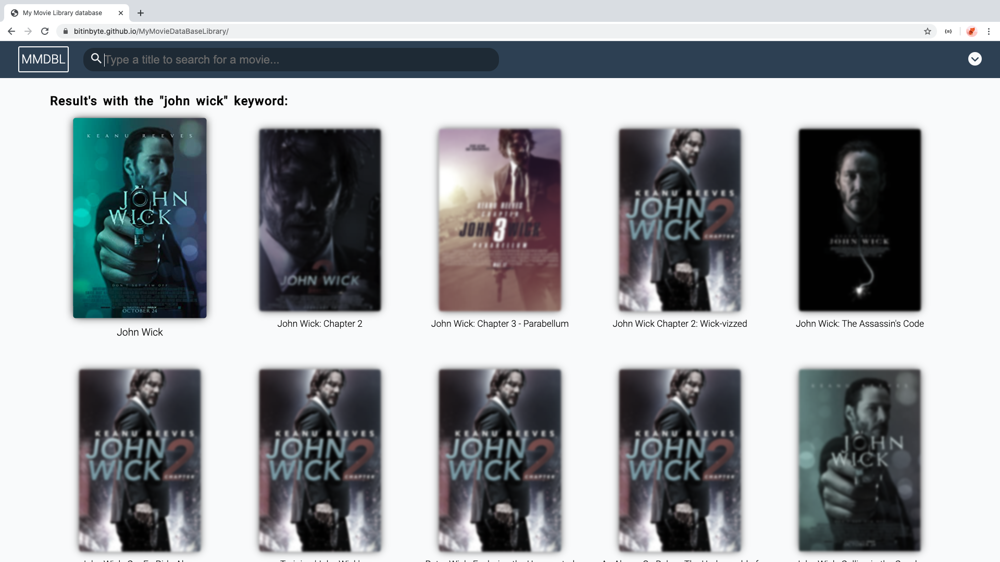

# My Movie DataBase Library  
## [Check it here](https://bitinbyte.github.io/MyMovieDataBaseLibrary)

Thumbnail of the DataBase Movie library 
## Getting Started
The database is made with a free API that you can find here: [OMDB API](http://www.omdbapi.com/) - All credits on API to them.   
### Installing
  
The project can be cloned and there's two steps to test the project and can be tested by yourself, with all of the changes that you want to do!  
  
Step 1: Run the next script to create a live local server and build in dev mode in real time  

```
npm run start  
```
  
Step 2: Buil the project to be ready to production

```
npm run build  
```
  
The commands above need to be introduced on the root folder of the project.  
  
The project need an API key as well that you can get it free from the OMDB API. You just only need to change the api key on the models on the project.  
  
## Specifications
Project build in study case. This project was made to apply a bunch of new technologies learned on the last couple of weeks. In terms of layout, the project is following the same rules than the last project, it's without flexbox or grid, is used with only floating elements and other old tricks. This project was really challenging because, layouting without flexbox or grid is really hard. Beside that, this project is using multiple versions of the Vanilla JavaScript the opposite of the last project that I only used the ES5 version. Another feature used was node.js that was implemented the webpack to bundle all of the javascript files in just one file, babel to convert all of code that was wrote with features not supported in ES5 to ES5 features and polyfill to use the code that is impossible to be converted into ES5 code.  
## Built With
- HTML
- CSS3
- Vanilla JavaScript
- jQuery
- NodeJs:
	- webpack;
	- babel;
	- dontenv;  
## Contributing
Feel free to download it and improve it. If you want just give a pull request with your changes and let me know what can be improved. Many thanks :D
## Pages
- [GitHub Page](https://github.com/BitInByte)
- [Instagram](https://www.instagram.com/bitinbyte/)
- [Twitter](https://twitter.com/BitInByte2)
## Authors
**BitInByte** - Development student and tech enthusiastic

